# Model Context Protocol (MCP)

Puku Editor supports the **Model Context Protocol (MCP)**, allowing AI agents to connect to external services and use their tools directly from the editor.

This guide explains how to add and authenticate an MCP integration in Puku Editor. **Canva** is used as the example.

---

## What is MCP?

**MCP (Model Context Protocol)** is an open protocol that allows AI applications to connect to external tools, services, and data sources through a standardized interface.

In Puku Editor, MCP allows the AI agent to use capabilities provided by external MCP servers.

For example:

```text
Puku AI Agent
      ↓
     MCP
      ↓
Canva MCP Server
      ↓
   Canva Tools
      ↓
Create / Search / Edit / Export Designs
```

An **MCP server** exposes capabilities called **tools**. The Puku AI agent can discover these tools and use the appropriate tool when completing a task.


# Connect an MCP Server

## Step 1: Open Customize

Start from the Puku Editor main window.

In the left sidebar, select **Customize**.

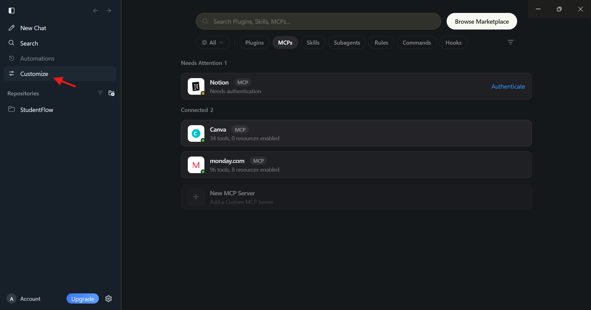

The Customize page provides access to Puku's configurable capabilities, including:

- Plugins
- MCPs
- Skills
- Subagents
- Rules
- Commands
- Hooks

---

## Step 2: Open the MCPs tab

After opening **Customize**, select the **MCPs** tab.

The MCP page contains three main areas:

- **Needs Attention** — MCP integrations that require an action, such as authentication.
- **Connected** — MCP integrations that are already connected.
- **New MCP Server** — an option for adding a custom MCP server.


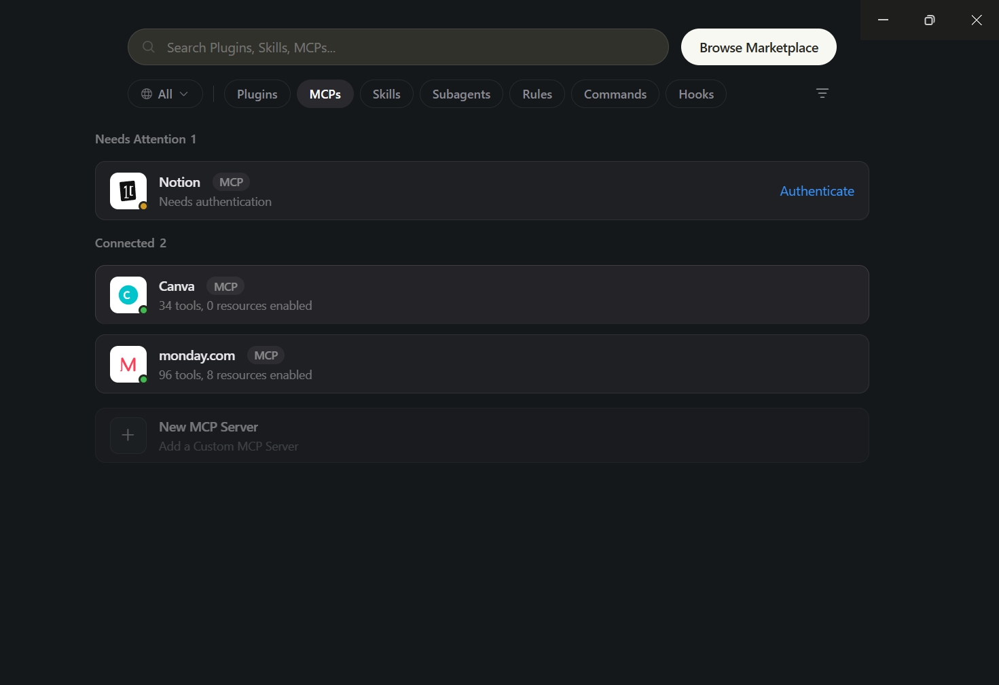


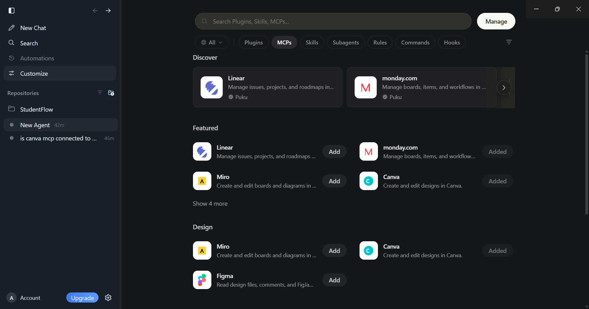


In the example above:

- **Notion** appears under **Needs Attention** because it requires authentication.
- **Canva** appears under **Connected**.
- **monday.com** appears under **Connected**.
- **New MCP Server** is available for custom MCP configuration.

---

# Add an MCP from the Marketplace

Puku also provides a **Browse Marketplace** option at the top of the Customize page.

Use the Marketplace to discover available MCP integrations.

When an MCP integration is selected, Puku can present an installation dialog with options for where the MCP should be added.

For example, Canva can be added either:

- **For Myself** — available for the current user.
- **To Project** — associated with a specific project.

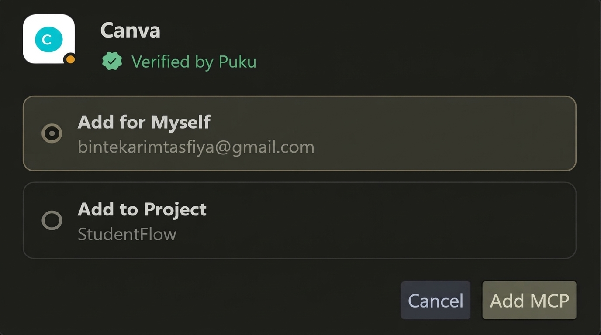


### Choose the installation scope

Select the appropriate option:

```text
Add for Myself
```

or:

```text
Add to Project
```

Then select:

```text
Add MCP
```

The selected MCP is added to Puku.


> The available installation scopes can depend on the MCP integration and the current Puku configuration.

---

# Authenticate an MCP Server

Some MCP integrations require authentication before they can be used.

## Step 1: Find the MCP under Needs Attention

If an MCP requires authentication, it appears under **Needs Attention**.

For example:

```text
Notion
MCP
Needs authentication
                    Authenticate
```

Select **Authenticate**.

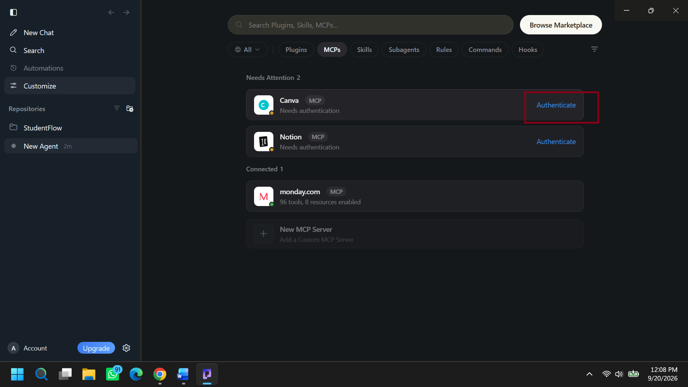

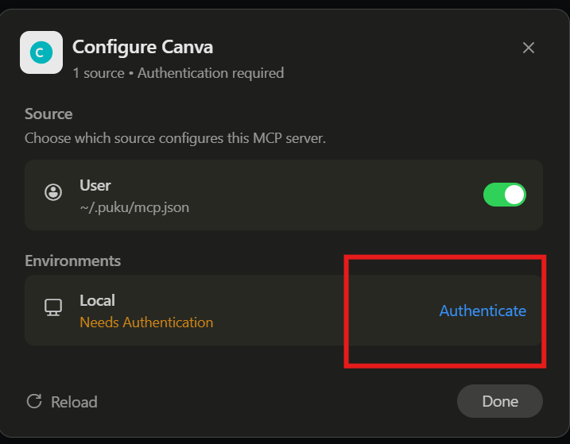

---

## Step 2: Complete the authentication flow

Puku opens the authentication flow for the selected MCP integration.

For OAuth-based services, authentication is completed through the service's authorization page.

Review the requested permissions before approving access.

For Canva, the authorization flow requests access to capabilities such as:

- Read profile and account information
- Read design metadata
- Create designs
- Read design content
- Read folders
- Upload, modify, and delete folders
- Read team Brand Templates
- Read team Brand Kits
- Publish brand templates
- Post and read comments
- Read asset metadata
- Upload, modify, and delete assets
- Get help with designing in Canva

Select **Allow** to authorize the connection.

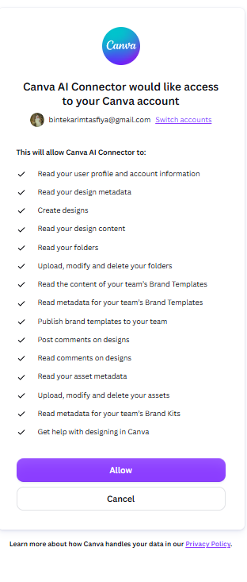

> Review the permissions carefully before granting access.

---

# Confirm the MCP Connection

After successful authentication, return to Puku Editor.

The MCP should now appear under **Connected**.

For example:

```text
Connected 2

Canva       MCP
34 tools, 0 resources enabled

monday.com  MCP
96 tools, 8 resources enabled
```

The number of tools and resources depends on the MCP server.

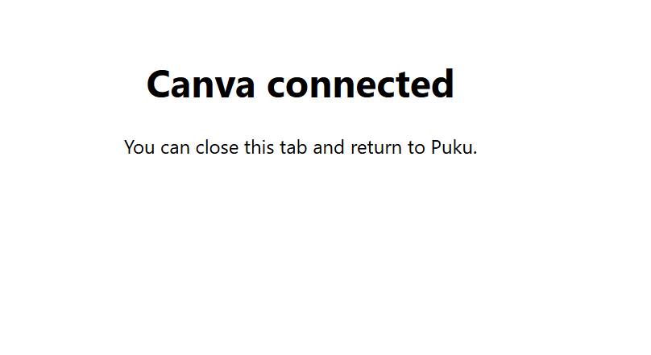


A green status indicator next to an MCP indicates that the integration is connected.

---

# Use MCP Tools in Puku

Once an MCP server is connected, its tools become available to the Puku AI agent.

For example, after connecting Canva, you can ask:

```text
Is Canva MCP connected to my project?
```

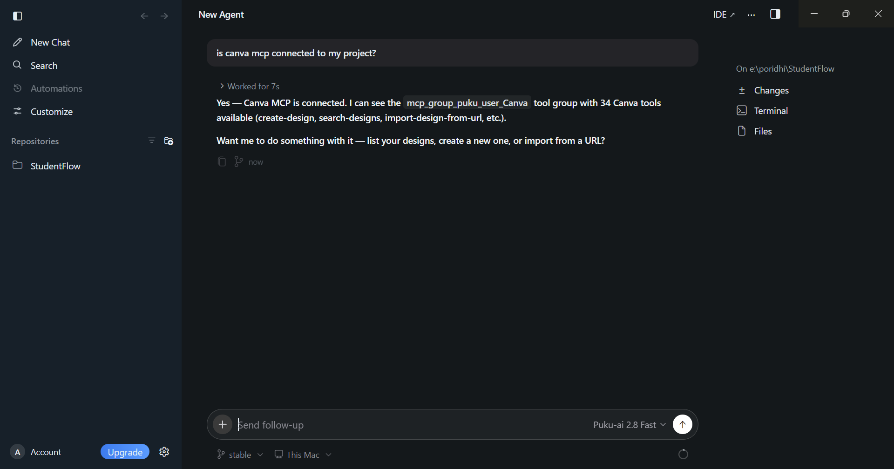

The agent can verify the connection and report the available Canva MCP tool group.

You can then ask the agent to perform supported tasks, such as:

```text
List my Canva designs.
```

or:

```text
Create a new Canva design.
```

The agent selects and invokes the appropriate MCP tool.

---

# Canva MCP Tools

After connecting Canva, Puku can expose the tools provided by the Canva MCP server.

The example shown in Puku reports **34 Canva MCP tools**.

> Tool availability can vary depending on the MCP server version, account permissions, authentication scope, and service-side changes.

## Folders

| Tool | Purpose |
|---|---|
| `create-folder` | Create a folder |
| `search-folders` | Search for folders |
| `list-folder-items` | List items in a folder |
| `move-item-to-folder` | Move an item into a folder |

## Designs — Read

| Tool | Purpose |
|---|---|
| `get-design` | Retrieve a design |
| `get-design-pages` | Retrieve pages from a design |
| `get-design-content` | Retrieve design content |
| `get-design-thumbnail` | Retrieve a design thumbnail |
| `get-design-candidates` | Retrieve design candidates |
| `search-designs` | Search for designs |

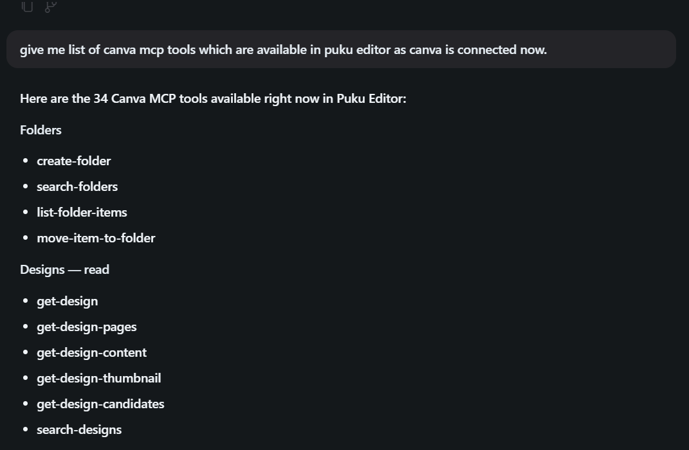

## Designs — Create/Edit

| Tool | Purpose |
|---|---|
| `generate-design` | Generate a design |
| `create-design-from-candidate` | Create a design from a candidate |
| `create-design-from-brand-template` | Create a design from a brand template |
| `import-design-from-url` | Import a design from a URL |
| `copy-design` | Copy a design |
| `resize-design` | Resize a design |
| `merge-designs` | Merge designs |
| `start-editing-transaction` | Start an editing transaction |
| `perform-editing-operations` | Perform editing operations |
| `commit-editing-transaction` | Commit an editing transaction |
| `cancel-editing-transaction` | Cancel an editing transaction |

## Export

| Tool | Purpose |
|---|---|
| `export-design` | Export a design |
| `get-export-formats` | Retrieve supported export formats |

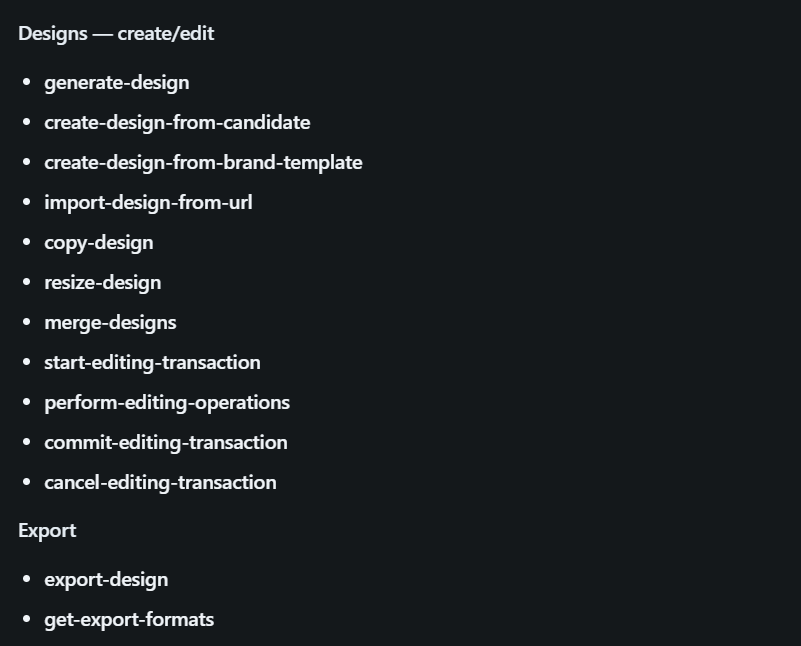

## Comments

| Tool | Purpose |
|---|---|
| `comment-on-design` | Add a comment to a design |
| `list-comments` | List comments on a design |
| `list-replies` | List replies to comments |
| `reply-to-comment` | Reply to a comment |

## Assets & Brand

| Tool | Purpose |
|---|---|
| `get-assets` | Retrieve assets |
| `upload-asset-from-url` | Upload an asset from a URL |
| `list-brand-kits` | List brand kits |
| `search-brand-templates` | Search brand templates |
| `get-brand-template-dataset` | Retrieve brand template data |


## Other

| Tool | Purpose |
|---|---|
| `get-presenter-notes` | Retrieve presenter notes |
| `resolve-shortlink` | Resolve a Canva short link |

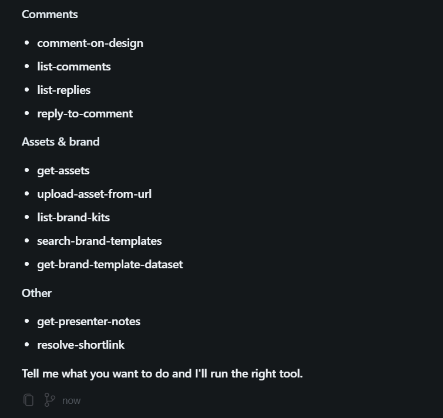

---

# MCP Configuration

Puku's MCP configuration is stored in the user-level configuration location shown in the MCP configuration UI:

```text
~/.puku/mcp.json
```

For MCP integrations installed through Puku's interface, use the Puku MCP workflow rather than manually editing the configuration unless manual configuration is required for a custom server.

---

# Add a Custom MCP Server

Puku provides a:

```text
New MCP Server
Add a Custom MCP Server
```

entry in the MCP page.

Use this option when you need to configure an MCP server that is not available as a preconfigured Marketplace integration.

The exact configuration depends on the MCP server and the transport it supports.

For a custom server, follow the server's configuration requirements and ensure that its command, URL, credentials, and other required parameters are correctly configured.

---

# Managing MCP Servers

The **Customize → MCPs** page provides a central place to manage MCP integrations.

## Needs Attention

MCP integrations that require an action appear under **Needs Attention**.

Typical examples include:

```text
Notion
MCP
Needs authentication
```

Select **Authenticate** to complete the required setup.

## Connected

Successfully configured MCP integrations appear under **Connected**.

For example:

```text
Canva
MCP
34 tools, 0 resources enabled
```

The displayed tool/resource count represents what Puku currently detects from that MCP server.

## New MCP Server

Select **New MCP Server** to configure a custom MCP server.

---

# Troubleshooting

## MCP shows "Needs authentication"

1. Open **Customize**.
2. Select **MCPs**.
3. Find the MCP under **Needs Attention**.
4. Select **Authenticate**.
5. Complete the external service's authorization flow.
6. Return to Puku.
7. Confirm that the MCP appears under **Connected**.

## Authentication was cancelled

Restart the authentication process:

1. Open **Customize → MCPs**.
2. Locate the MCP under **Needs Attention**.
3. Select **Authenticate** again.
4. Complete the authorization flow.
5. Return to Puku.

## MCP is connected but tools are unavailable

Try the following:

1. Open **Customize → MCPs**.
2. Confirm that the MCP appears under **Connected**.
3. Reload the MCP configuration if the option is available.
4. Start a new chat/agent session.
5. Ask the agent to identify or use one of the MCP's available tools.

## Tool count is different from the documentation

The available tools can change because of:

- MCP server version
- Account permissions
- Authentication scopes
- Enabled capabilities
- Service-side changes

The tools currently displayed or discovered by Puku are the authoritative set for that connection.

---

# Security and Permissions

MCP integrations can give an AI agent access to external services and data.

Before connecting an MCP server:

- Review the permissions requested by the service.
- Verify that the MCP integration comes from a trusted source.
- Understand what actions the available tools can perform.
- Avoid granting unnecessary permissions.
- Review authorization requests before selecting **Allow**.

For OAuth-based integrations, such as Canva, the external service controls the authorization and permission prompt.

---

# End-to-End Workflow

The complete MCP connection workflow in Puku is:

```text
Open Puku Editor
       ↓
Customize
       ↓
MCPs
       ↓
Browse Marketplace / Select MCP
       ↓
Add for Myself OR Add to Project
       ↓
Add MCP
       ↓
Authenticate (if required)
       ↓
Authorize on external service
       ↓
Return to Puku
       ↓
MCP appears under Connected
       ↓
MCP tools become available
       ↓
Use MCP through the Puku AI agent
```

For Canva:

```text
Puku Editor
    ↓
Customize
    ↓
MCPs
    ↓
Browse Marketplace
    ↓
Canva
    ↓
Add for Myself / Add to Project
    ↓
Add MCP
    ↓
Authenticate / Authorize Canva
    ↓
Canva Connected
    ↓
34 Canva tools available
    ↓
Puku AI Agent
```

---

# Summary

Puku Editor provides an MCP workflow for connecting AI agents to external services.

The basic process is:

1. Open **Customize**.
2. Select **MCPs**.
3. Find an MCP through the available integrations or **Browse Marketplace**.
4. Choose the installation scope when prompted.
5. Select **Add MCP**.
6. Authenticate when required.
7. Approve the external service's requested permissions.
8. Return to Puku.
9. Confirm that the MCP appears under **Connected**.
10. Use the MCP's available tools through the Puku AI agent.
