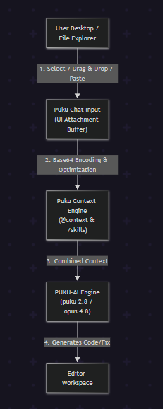

# Image Upload

Seamlessly integrate visual content into your development workflow. Upload mockups, screenshots, wireframes, and architectural diagrams directly into Puku Editor to generate code, refactor UI, or debug visual elements with context-aware AI.

The Image Upload feature extends Puku's context engine to support multimodal inputs, enabling **PUKU-AI Engine** to process visual and textual code contexts side by side.

---

## What You Can Do

Image Upload goes beyond text-based prompting by providing deep visual analysis directly inside your editor environment:

- **Generate Code from Mockups**: Upload Figma designs, wireframes, or UI screenshots to automatically generate clean, responsive components tailored to your project's styling and setup.
- **Visual Debugging**: Attach screenshots of runtime UI bugs, console errors, or broken layouts to receive targeted fixes.
- **Architecture & Diagram Analysis**: Share system diagrams, flowcharts, or database schema images to get implementation guidance or architecture explanations.
- **Multimodal Context**: Combine images with file references (`@`), custom skills (`/`), and repository context for accurate code generation.

---

## How to Access

| Method | Action |
| :--- | :--- |
| **Input Bar Attachment Button** | Click the **`+`** icon inside the chat prompt input bar. |
| **Drag and Drop** | Drag any image file directly from your local file explorer into the Puku Chat panel. |
| **Clipboard Paste** | Copy an image to your clipboard and press `Ctrl+V` (or `Cmd+V`) inside the input box. |


---

## UI Overview & Interface

The updated Puku Chat panel includes dedicated controls for attaching and managing visual context alongside your code prompts, supporting models like **puku 2.8**, **puku 2.7**, and **opus 4.8**.


### Key Interface Elements

1. **Attachment Button (`+`)**: Located at the bottom-left of the main prompt field. Triggers the file selection menu.
2. **Model Selector**: Choose visual-capable engines such as `puku 2.8`, `puku 2.7`, and `opus 4.8`.
3. **Execution Button (`^`)**: Sends the prompt and visual attachments to the context stream.
4. **Action Shortcuts**: Quick toggles like `Plan New Idea (^Tab)`, `Multitask`, and `Run in Cloud`.

---

## Technical Workflow & Architecture

Here is how Puku processes image uploads and passes them into the multimodal AI context stream:

```

```

---

## Image Upload Features

### 1. Combining Visuals with `@ Context` and `/ Skills`

You can attach images while using Puku's native skill triggers (`/`) and context tags (`@`):


### 2. Multi-Image Attachments

Attach multiple images in a single session to compare UI layouts, demonstrate multi-step user flows, or provide before/after screenshots for refactoring.


---

## Specifications & Limits

| Parameter | Limit / Detail |
| :--- | :--- |
| **Supported Formats** | PNG, JPG, JPEG, WEBP, SVG |
| **Maximum File Size** | 20 MB per file |
| **Max Images Per Prompt** | Up to 5 images |
| **Compatible Models** | `puku 2.8`, `puku 2.7`, `opus 4.8` |

---

## Troubleshooting

#### Why is my image failing to attach?
Verify that the image format is supported (`.png`, `.jpg`, `.jpeg`, `.webp`, `.svg`) and that the file size is under **20 MB**.

#### Does Puku support code extraction from screenshots (OCR)?
Yes, `puku 2.8`, `puku 2.7`, and `opus 4.8` automatically read and parse code snippets, error traces, and UI labels visible within uploaded images.
