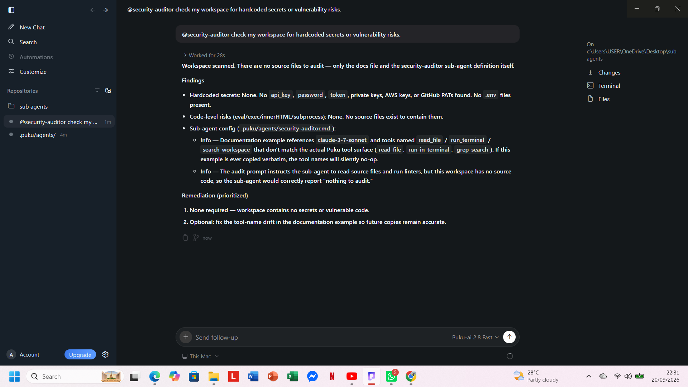
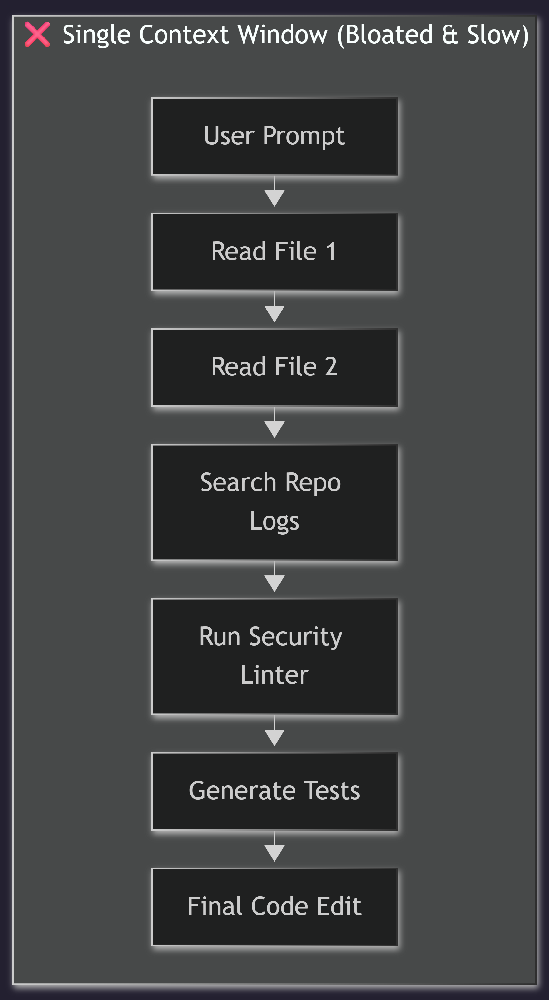
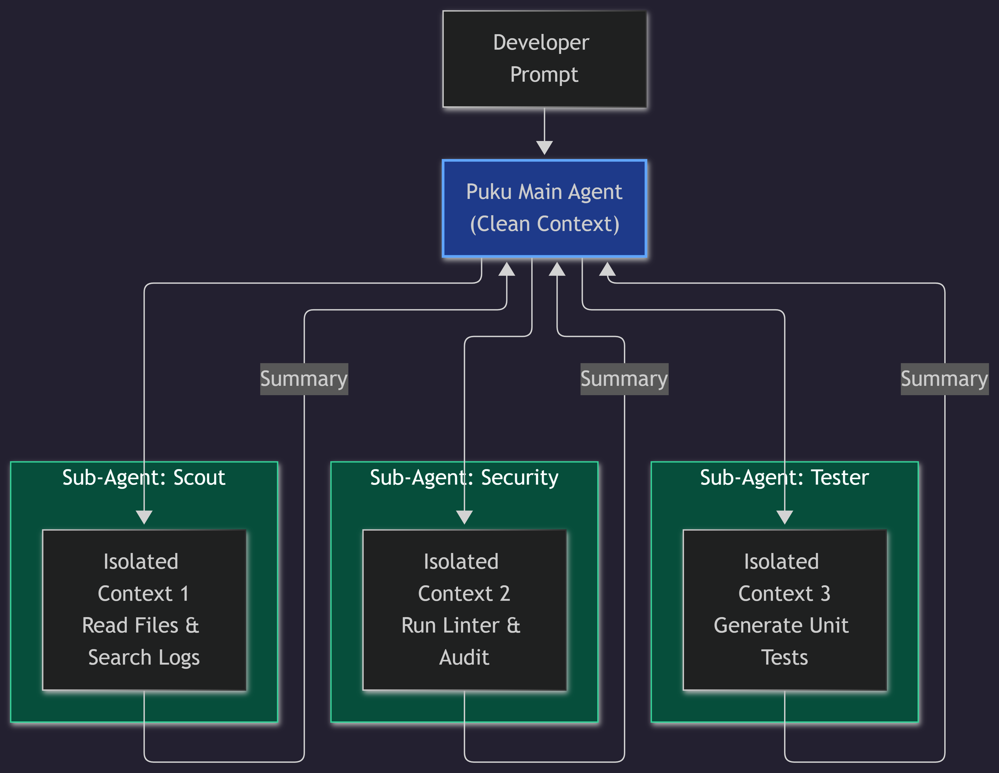
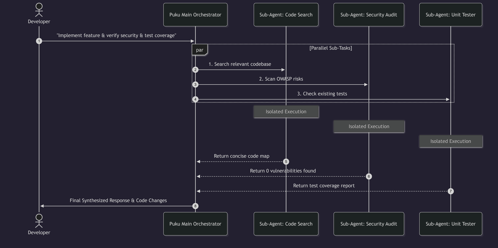
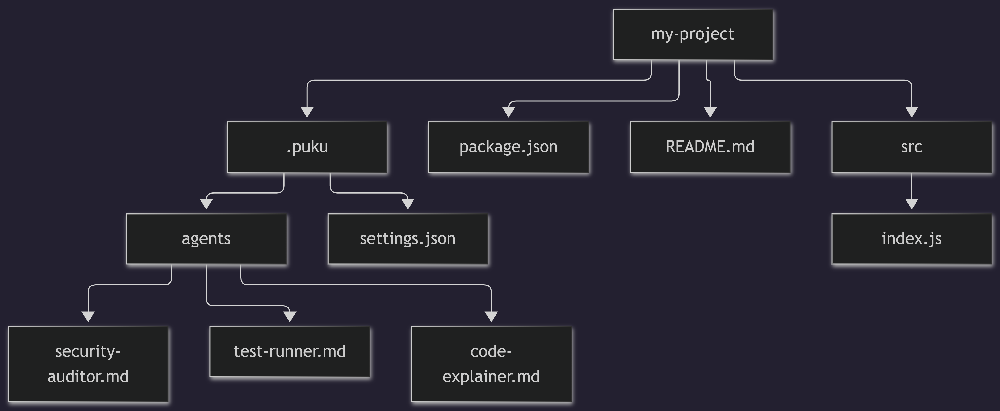
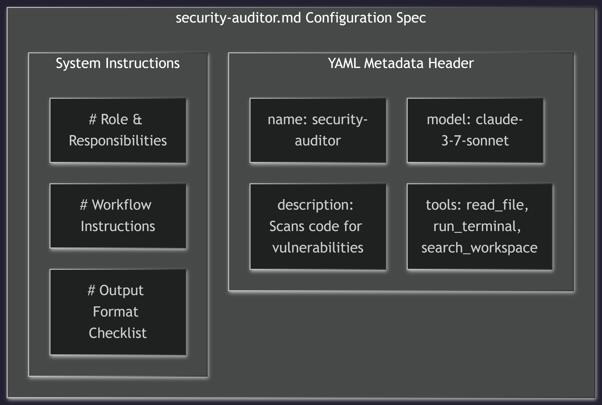
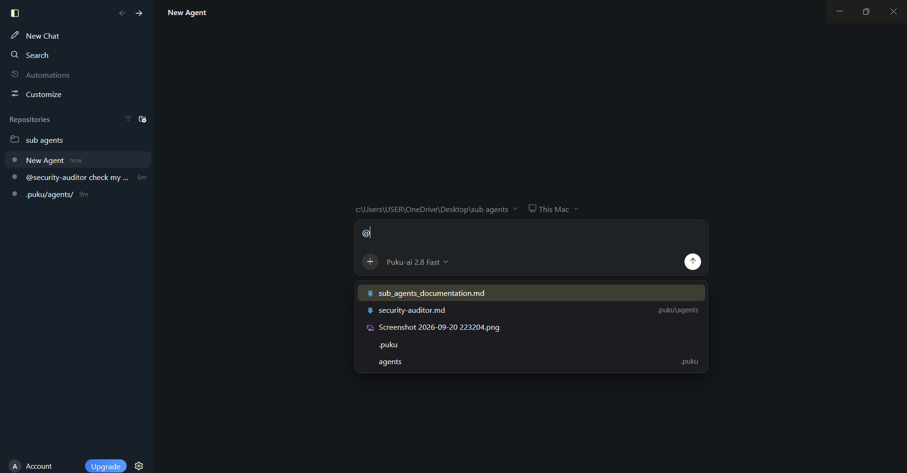
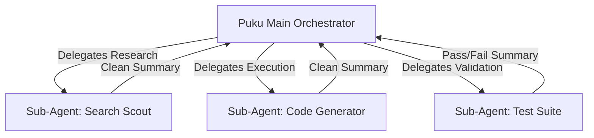

# Sub-Agents in Puku Editor

Sub-Agents are specialized AI workers that operate within isolated context windows under the direction of your primary Puku session. Rather than overloading a single conversation context with extensive file searching, test runs, or code reviews, Puku allows the primary agent to delegate focused tasks to dedicated sub-agents.




---

## Why Use Sub-Agents?

As projects scale, providing an AI agent with full repository context and continuous tool call history can lead to token bloat, high latency, and degraded task performance.

* **Context Isolation:** Sub-agents run in independent sub-sessions. Intermediate chatter, search steps, and raw execution logs do not pollute your main chat history.
* **Task Specialization:** Custom instructions, scoped tool sets, and distinct system prompts ensure each sub-agent acts as a domain expert.
* **Parallel Execution:** Run multiple sub-agents simultaneously (e.g., code reviewer, unit test builder, and security auditor) to accelerate multi-step tasks.
* **Custom Model Assignment:** Assign specific models (e.g., faster models for simple tasks, highly analytical models for architecture reviews) to specific roles.

Before:


After:



---

## Architecture & Workflow

When you request a complex task, Puku's main orchestrator delegates sub-tasks to worker agents. Each sub-agent processes its assigned task autonomously and returns a synthesized result back to the main thread.  




## Creating Sub-Agents

Sub-agents can be defined either **Project-wide** (version-controlled with your team) or **Globally** (available across all your local workspaces).

### Directory Structure




* **Project-level:** Place in `.puku/agents/` at the root of your project repository.
* **Global-level:** Place in `~/.puku/agents/` in your user home directory.

---

## Configuration Spec

Sub-agents are configured using Markdown files with a YAML frontmatter header. The frontmatter configures the operational metadata, and the markdown body serves as the agent's **system prompt**.

### Example: `.puku/agents/security-auditor.md`

## Configuration Spec

Sub-agents are configured using Markdown files stored in `.puku/agents/`. Each definition combines a YAML frontmatter header with structured system instructions.


```

---

## Configuration Reference

| Property | Type | Default | Description |
| :--- | :--- | :--- | :--- |
| `name` | `string` | File name | Unique identifier used by Puku to reference and call the agent. |
| `description` | `string` | *(Required)* | Clear description of purpose. Used by the primary agent to auto-delegate. |
| `model` | `string` | Editor default | AI model assigned specifically to this sub-agent. |
| `tools` | `array` | All tools | List of tools this sub-agent is permitted to call. |
| `user-invocable` | `boolean` | `true` | If `false`, hides agent from the picker so it can only be invoked by the main agent. |

---
## Invoking Sub-Agents

You can manually trigger any sub-agent in your project by typing `@` in the Puku chat panel to bring up the agent selector menu.


## Delegation Mechanics & Parallelism

Sub-agents work best when assigned non-overlapping responsibilities. You can trigger sub-agents manually by typing `@sub-agent-name` in the chat, or allow Puku to auto-route tasks based on the sub-agent's `description`.



---

## Best Practices

1. **Keep Tools Least-Privileged:** Give sub-agents only the tools required for their specific role (e.g., restrict research agents to read-only tools like `read_file` and `search_workspace`).
2. **Explicit Contracts:** Define exact output structures in the markdown prompt (e.g., JSON schemas or markdown checklists).
3. **Avoid Overlapping Writes:** If multiple sub-agents run concurrently, ensure they do not attempt to edit the same file simultaneously.
4. **Single-Level Nesting:** Puku limits sub-agents from spawning nested sub-agents to prevent infinite execution loops and maintain control.
