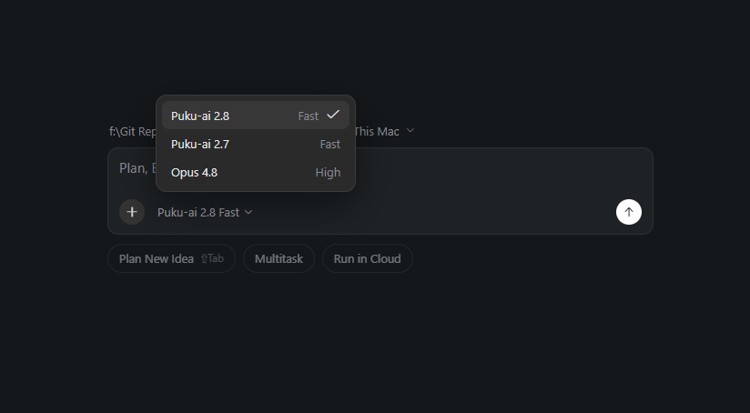
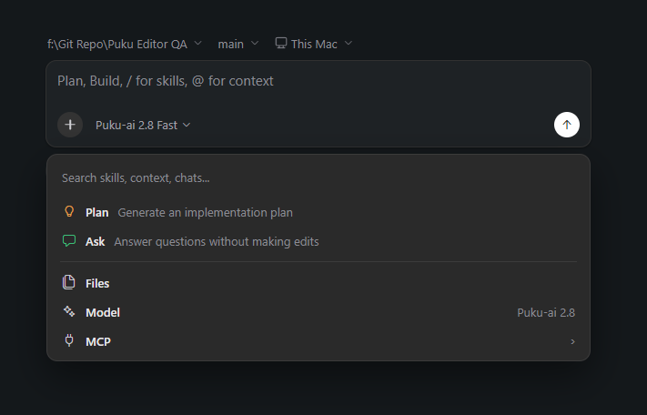
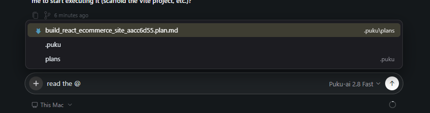

# Composer and Context

The composer is where you prepare the Agent's next turn. In addition to writing a prompt, you can select a model, switch modes, add files as context, and access MCP options.

## Choose a model

Select the current model name in the composer to open the model picker.

The current Agent Window includes:

- **Puku-ai 2.8** — Fast
- **Puku-ai 2.7** — Fast
- **Opus 4.8** — High

## Open the composer menu

Select the **+** button in the composer to open the context and mode menu.

From this menu, you can access:

- **Plan** — generate an implementation plan
- **Ask** — answer questions without making edits
- **Files** — add project files as context
- **Model** — change the active model
- **MCP** — open available MCP options

## Add project files with @

Type `@` in the composer to search for files from the current project and add one as context.

After selecting a file, it appears as a file mention in the prompt.

Use file context when you want the Agent to focus on a specific file or reference it directly in the next response.
