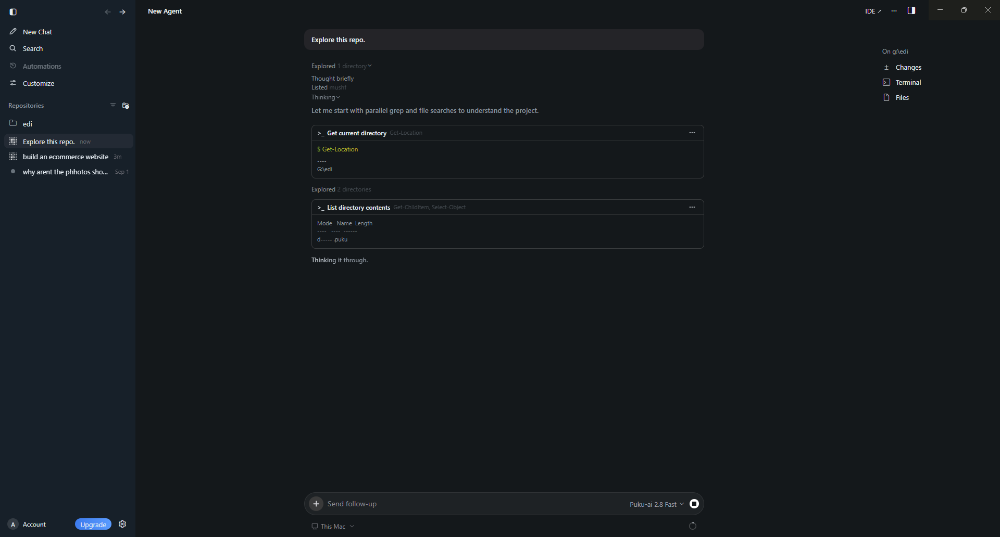

# Live Exploration

While the Agent works, the conversation can show the actions it performs as part of the task.

This gives you visibility into how the Agent explores the repository and gathers context.

Activity can include actions such as:

- Inspecting the current directory
- Listing project contents
- Reading files
- Running shell commands
- Searching the repository

Each action appears inline with the Agent's progress so you can follow what it is checking while the task is running.
