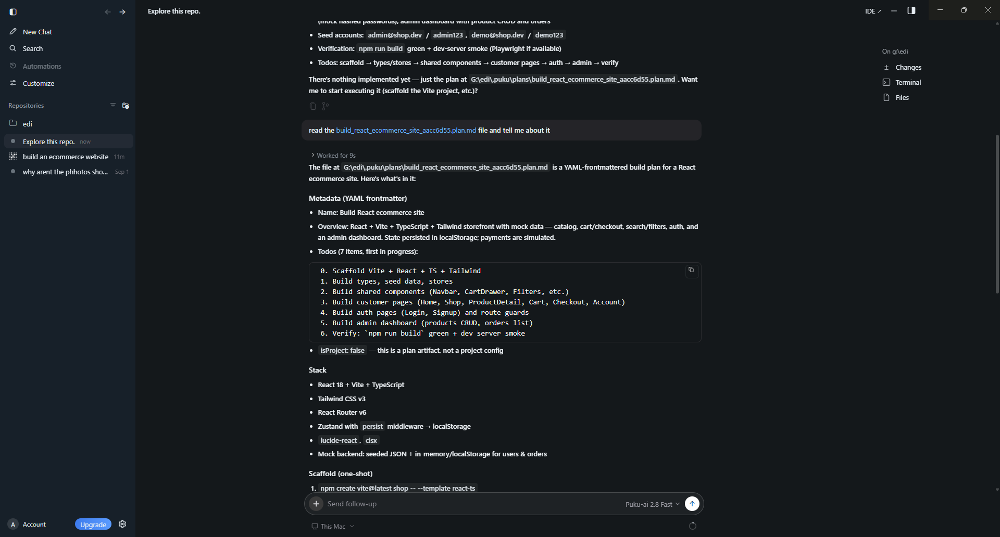
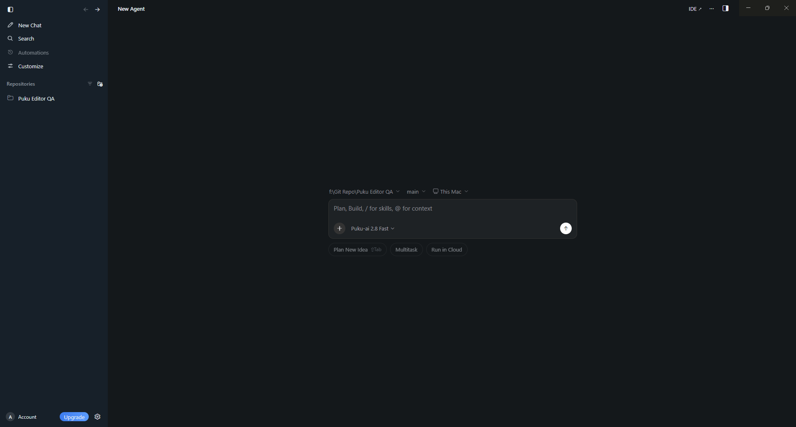

# Agent Window

The **Agent Window** is a dedicated workspace in Puku Editor for working with Puku agents. It brings the conversation, project context, files, terminal sessions, plans, and agent activity into one interface.

Use the Agent Window when you want to explore a repository, ask questions about a codebase, plan an implementation, or work through changes while keeping the relevant project tools close to the conversation.

## Start a new agent

Select **New Chat** from the left sidebar to open a new agent session.

Before you send a prompt, the composer shows the current project, branch, execution target, and model. You can change these before starting the task.

The Agent Window keeps previous sessions in the sidebar so you can return to earlier work without leaving the workspace.

## Main areas

The Agent Window is organized around three main areas:

- **Sidebar** — access new chats, Search, Automations, Customize, repositories, previous agents, and account controls.
- **Conversation** — enter prompts, select models and modes, add context, and follow the Agent's work.
- **Inspection area** — open Changes, Terminal, and File tools beside the conversation.

The rest of this section explains these parts in more detail.
