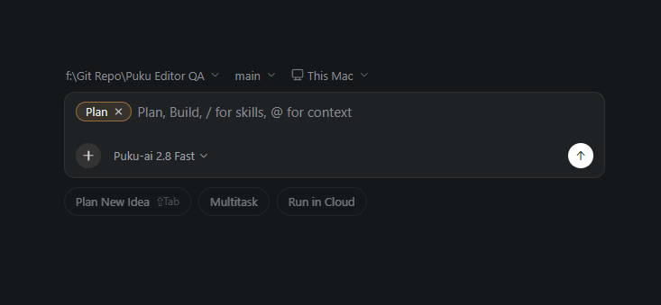
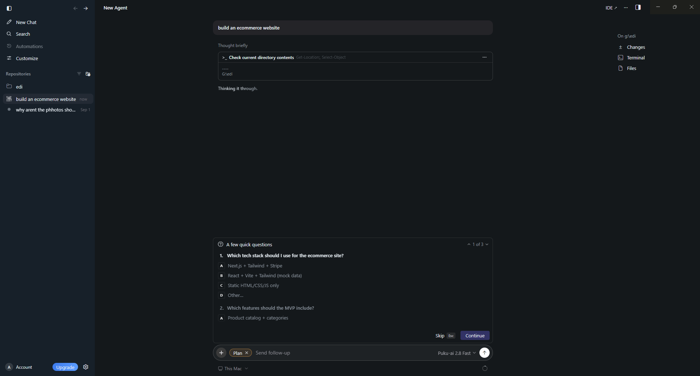
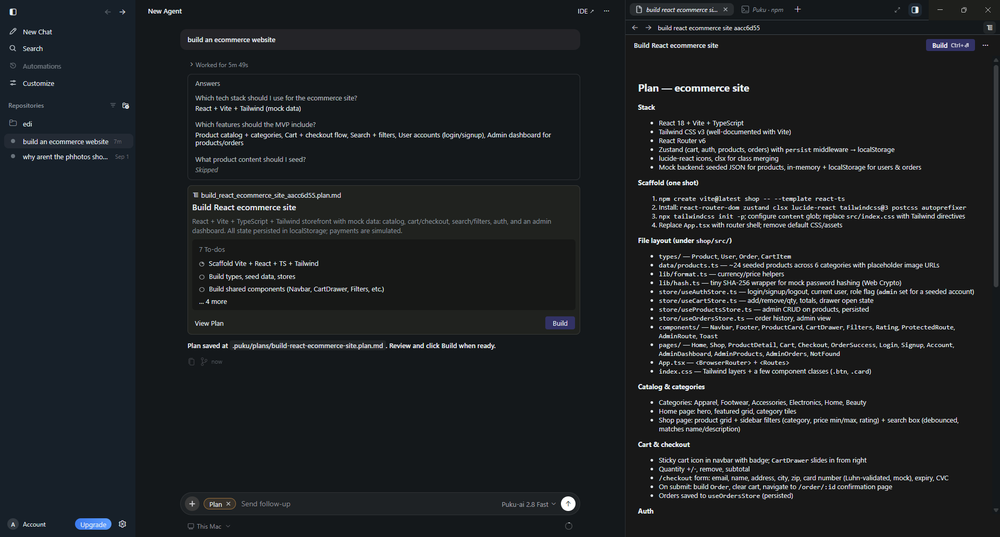
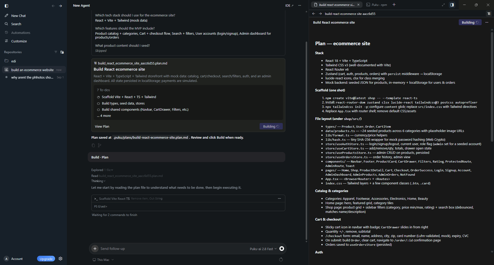

# Plan Mode

Use **Plan** mode when you want the Agent to design an implementation approach before making changes.

Plan mode is useful for larger tasks where you want to review the proposed approach, files, and work items before the Agent starts building.

## Start Plan mode

Open the composer menu and select **Plan**.

A **Plan** chip appears in the composer to show that the next prompt will run in Plan mode.

## Answer clarifying questions

The Agent may ask a short set of questions before generating a plan.

For example, it can ask about the technology stack, requested features, or other implementation details. Choose the relevant answers and select **Continue**, or skip questions when appropriate.

## Review the plan

When the plan is ready, Puku shows a plan card in the conversation and opens the full plan in the inspection area.

The plan can include:

- Implementation scope
- Technology choices
- File layout
- Tasks and todos
- Verification steps

Review the plan before implementation begins.

## Build from the plan

Select **Build** when you are ready for the Agent to execute the plan.

The Agent continues in the same session and begins working through the planned tasks. You can keep the plan open while following implementation progress in the conversation.

