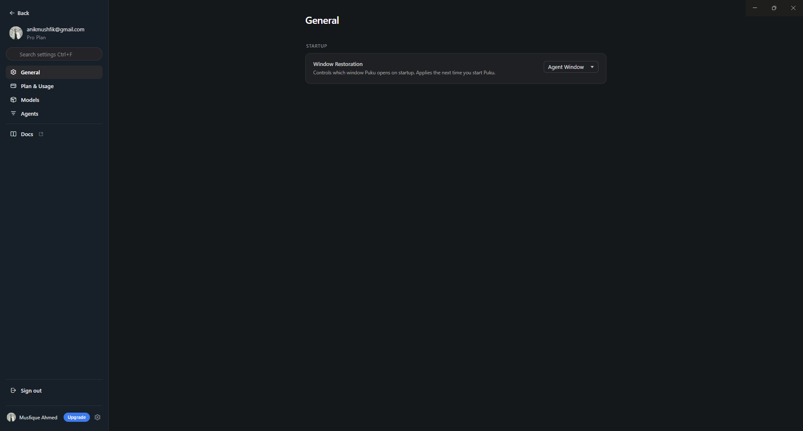
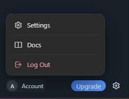

# Settings and Account

Agent Window settings and account controls are available from the lower-left area of the window.

## Agent Window startup

Open **Settings** and select **General** to configure startup behavior.

Under **Window Restoration**, you can choose which window Puku opens on startup. Select **Agent Window** when you want Puku to start directly in the Agent Window.

Other settings sections available from the sidebar include:

- **Plan & Usage**
- **Models**
- **Agents**
- **Docs**

## Account menu

Select the account control in the lower-left corner to open the account menu.

From this menu, you can open:

- **Settings**
- **Docs**
- **Log Out**

The **Upgrade** button remains available beside the account controls.
