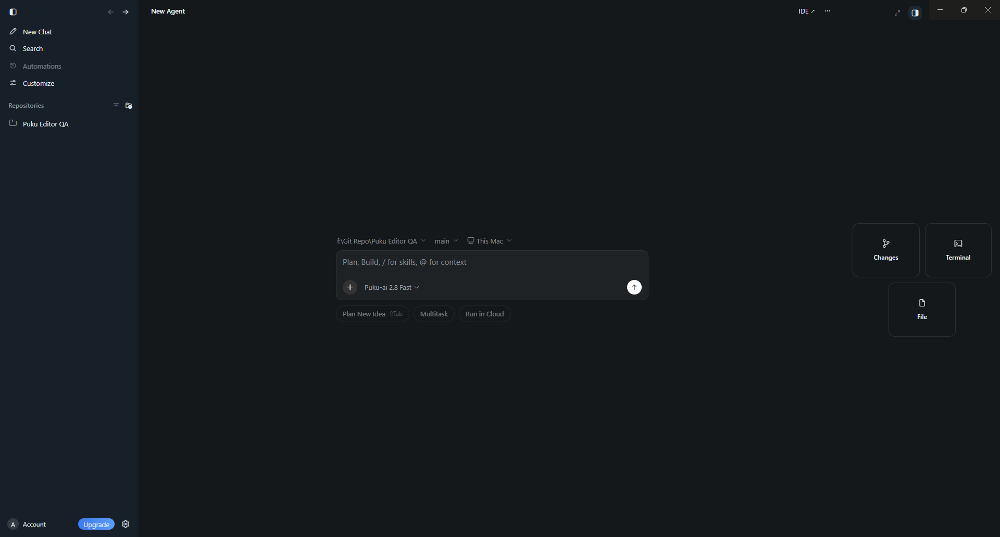
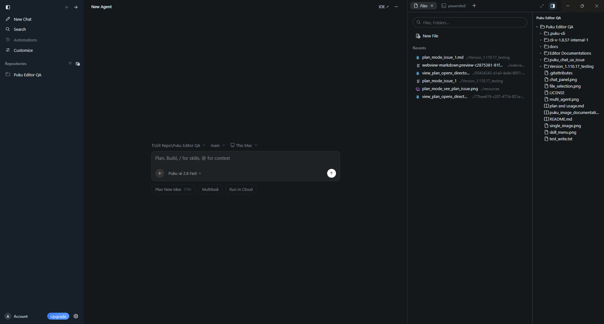
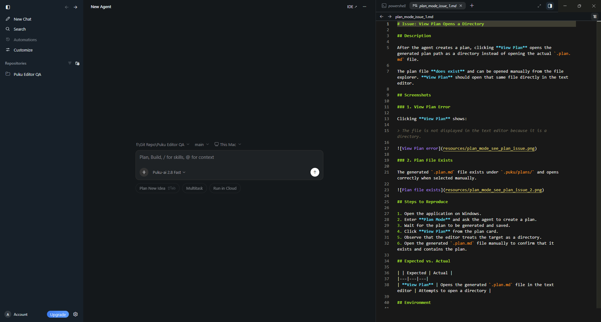
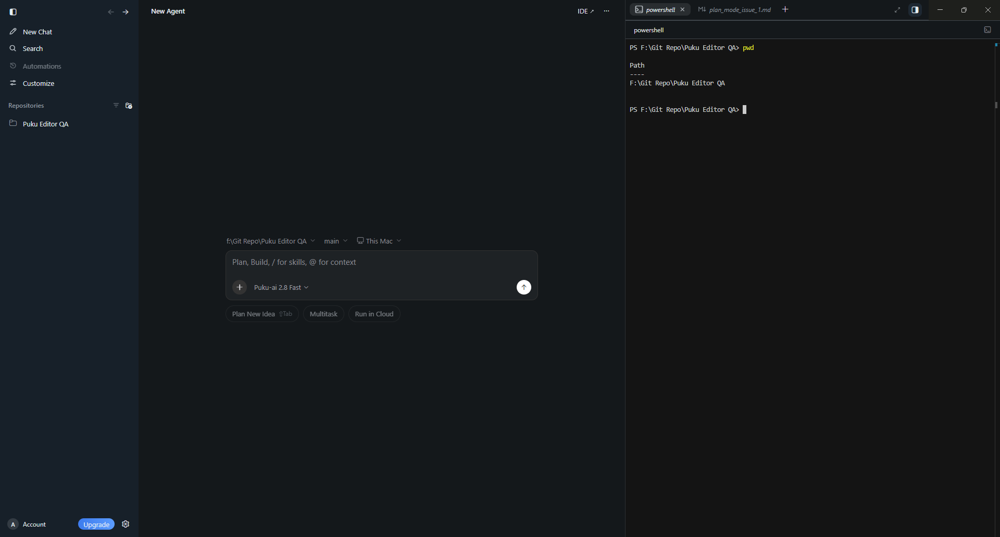
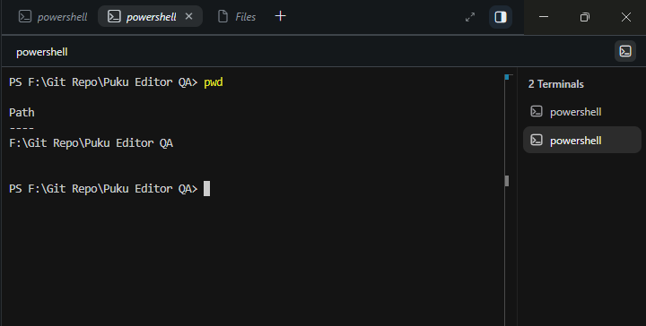

# Workspace and Inspection

The Agent Window includes an inspection area on the right side of the window. Use it to inspect project changes, work with files, and open terminal sessions without leaving the conversation.

## Open the inspection area

Use the inspection launcher on the right side of the Agent Window.

The available tools include:

- **Changes**
- **Terminal**
- **File**

## Files

Open **File** to browse the current project.

The Files view includes a project tree and a list of recent files. You can search for files and folders or create a new file directly from the panel.

## Edit a file

Select a file from the project tree or recent files to open it in the editor.

The conversation stays visible on the left while the file editor opens on the right, making it easier to compare the Agent's work with the project source.

## Terminal

Open **Terminal** to work with the project's shell beside the conversation.

The terminal uses the current project context, so you can run commands and inspect output without switching back to the Classic IDE.

## Multiple terminals

You can keep multiple terminal sessions open at the same time.

The terminal panel shows each active session so you can switch between them while staying in the same Agent Window.

