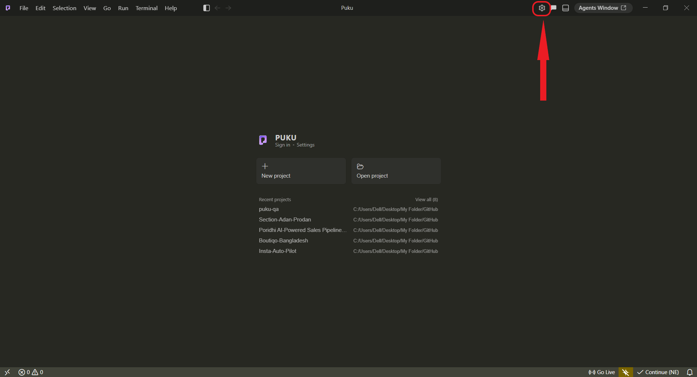
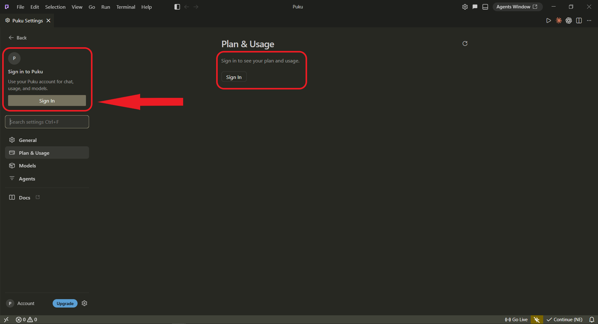
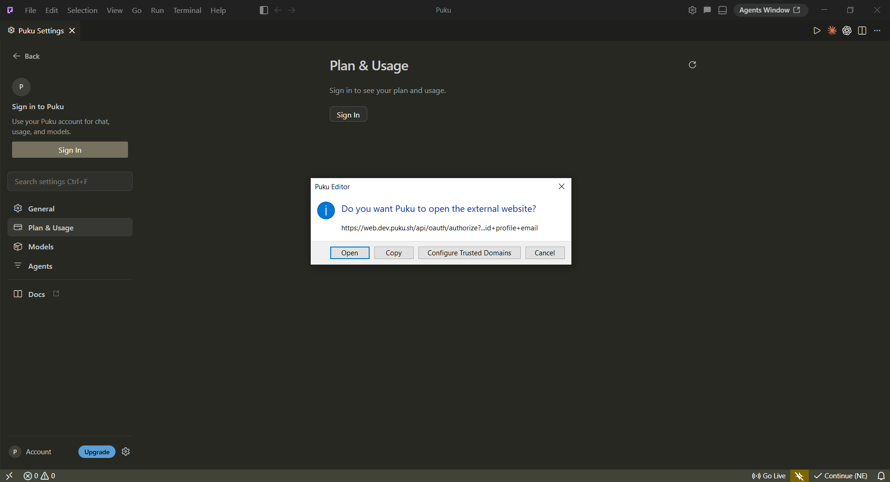
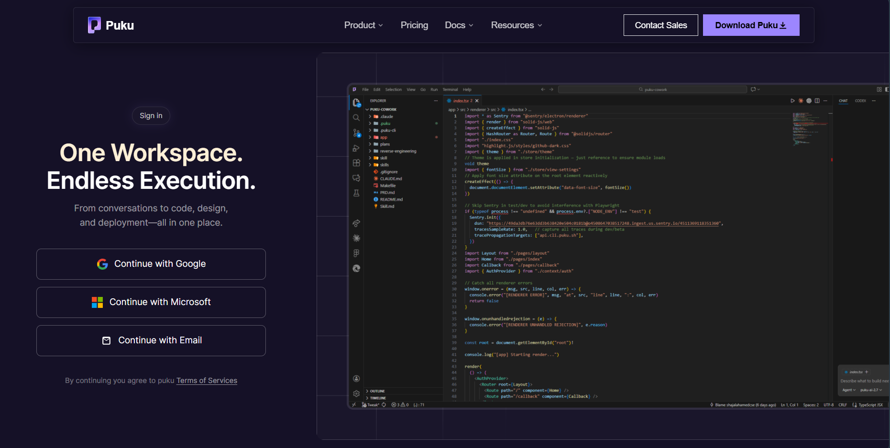
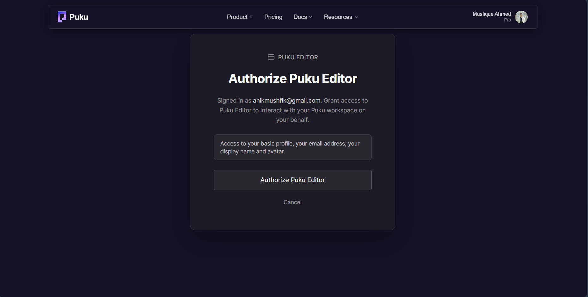
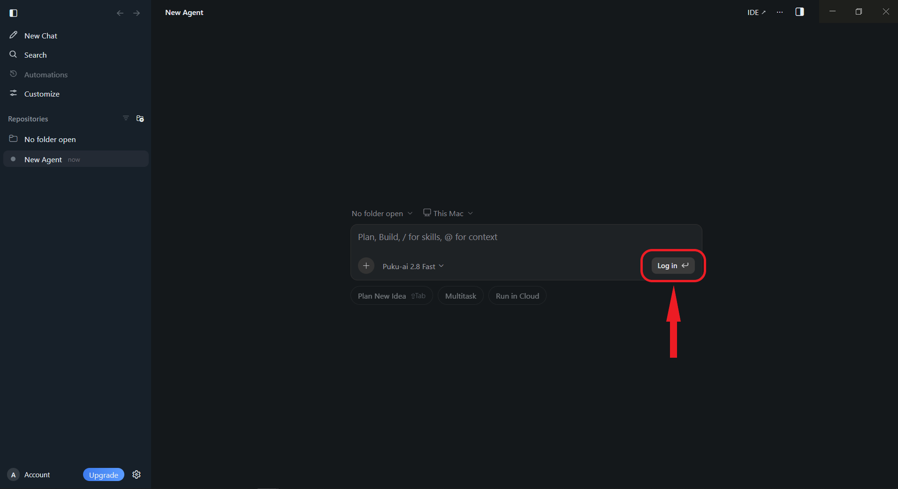
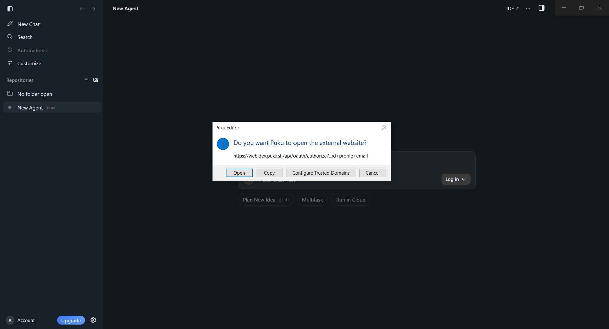

# Sign in

Sign in to Puku Editor to connect the editor to your Puku account. Once signed in, Puku can use your account for chat, usage, models, and other account-backed features.

You can start the sign-in flow from **Puku Settings** or directly from the **Agents Window**.

## Sign in from Puku Settings

### 1. Open Puku Settings

Open Puku Editor and select the **Settings** icon in the upper-right corner.

### 2. Select Sign In

In **Puku Settings**, select **Sign In** from the account section on the left.

When you are signed out, the **Plan & Usage** page also displays a sign-in prompt.

### 3. Allow Puku to open the sign-in page

Puku Editor opens a confirmation dialog before launching the authentication page in your browser.

Select **Open** to continue.

> This confirmation is expected. Selecting **Cancel** stops the sign-in flow, and you can start it again from Puku Settings.

### 4. Choose a sign-in method

Your browser opens the Puku sign-in page. Choose one of the available methods:

- **Continue with Google**
- **Continue with Microsoft**
- **Continue with Email**

Complete the authentication steps for the method you selected.

### 5. Authorize Puku Editor

After signing in on the web, Puku asks you to authorize Puku Editor to interact with your Puku workspace.

The authorization screen shows the account you are signed in with and requests access to your:

- Basic profile
- Email address
- Display name
- Avatar

Select **Authorize Puku Editor** to continue.

If you do not want to authorize the editor, select **Cancel**.

## Sign in from the Agents Window

You can also start the same authentication flow while using the Agents Window.

### 1. Select Log in

When you are signed out, the agent prompt displays a **Log in** button. Select it to start authentication.

### 2. Open the authentication page

Puku Editor asks for confirmation before opening the external sign-in page.

Select **Open**.

Then complete the browser sign-in and **Authorize Puku Editor** steps described above.

## Switching or cancelling during sign-in

The authorization page shows which Puku account is currently signed in. Verify the account before selecting **Authorize Puku Editor**.

If you cancel the external website prompt or the authorization screen, Puku Editor is not authorized. Start the sign-in flow again from **Puku Settings** or the **Agents Window** when you are ready.
