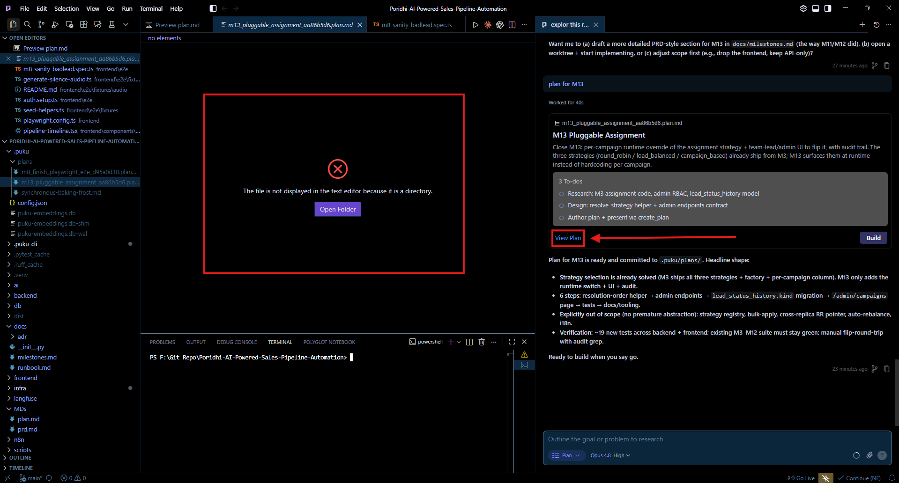
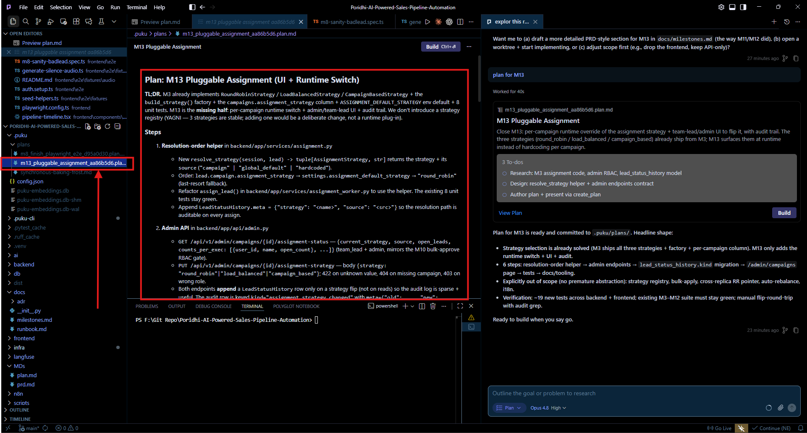

# Issue: View Plan Opens a Directory

## Description

After the agent creates a plan, clicking **View Plan** opens the generated plan path as a directory instead of opening the actual `.plan.md` file.

The plan file **does exist** and can be opened manually from the file explorer. **View Plan** should open that same file directly in the text editor.

## Screenshots

### 1. View Plan Error

Clicking **View Plan** shows:

> The file is not displayed in the text editor because it is a directory.

### 2. Plan File Exists

The generated `.plan.md` file exists under `.puku/plans/` and opens correctly when selected manually.

## Steps to Reproduce

1. Open the application on Windows.
2. Enter **Plan Mode** and ask the agent to create a plan.
3. Wait for the plan to be generated and saved.
4. Click **View Plan** from the plan card.
5. Observe that the editor treats the target as a directory.
6. Open the generated `.plan.md` file manually to confirm that it exists and contains the plan.

## Expected vs. Actual

| | Expected | Actual |
|---|---|---|
| **View Plan** | Opens the generated `.plan.md` file in the text editor | Attempts to open a directory |

## Environment

- **OS:** Windows
- **Version:** 1.110.17
- **Reporter:** Musfique
