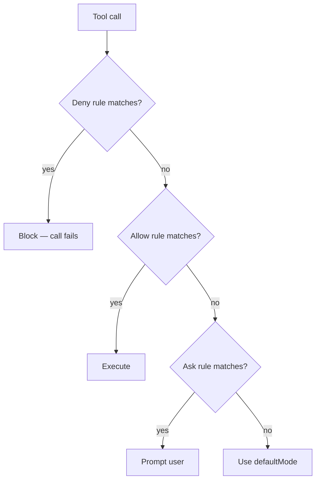
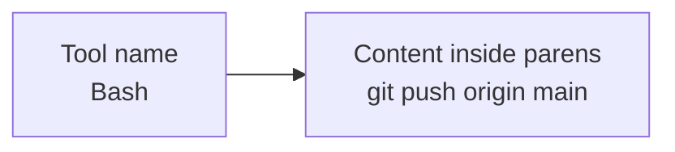
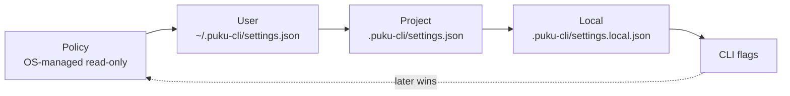

# Permissions

puku-cli ships with a per-tool permission system that gates every potentially
sensitive action (running shell commands, editing files, reading files outside
the project, spawning sub-agents, fetching URLs, etc.). You can configure this
system either **interactively** through the `/permissions` screen or **directly**
by editing the underlying `settings.json` files.

This guide covers both flows, the exact rule syntax, and how precedence works.

---

## How permissions work

The rest of this guide unpacks the following rule of thumb:

> **Deny beats allow. Allow beats ask. Ask beats `defaultMode`.**

---

## Permission evaluation flow



---

## The three permission behaviors

Every rule belongs to one of three behaviors:

| Behavior | Meaning |
|---|---|
| `allow` | Auto-approve matching tool calls. No prompt. |
| `deny`  | Block matching tool calls outright. The tool call fails with an error message. |
| `ask`   | Show a permission prompt each time the tool is used. |

### Precedence

When more than one rule matches a tool call, puku-cli resolves them in this order:

1. **`deny`** wins — a deny match always rejects, no matter what other rules say.
2. **`allow`** short-circuits — if a deny didn't match and an allow matches, the call runs.
3. **`ask`** — if neither deny nor allow matched, an ask rule surfaces a prompt.
4. **Default mode** — if nothing matches, the current `defaultMode` (see §6) decides.

`shadowedRuleDetection.ts` will warn you when a later rule in the same list is
unreachable because a broader earlier rule already matched.

---

## Manage permissions interactively

### The `/permissions` command

Type `/permissions` (alias: `/allowed-tools`) in the puku-cli REPL. A full-screen
Ink UI opens with five tabs:

| Tab | Purpose |
|---|---|
| `allow`    | Manage the allow rules list |
| `ask`      | Manage the ask rules list |
| `deny`     | Manage the deny rules list |
| `workspace`| Manage additional working directories puku-cli may read/edit |
| `recent`   | Recently denied tool calls (in `auto` mode) |

### Adding a rule

1. Navigate to the tab you want (`allow`, `ask`, or `deny`).
2. Use **Add Rule** to open `AddPermissionRules`.
3. Type a rule string (e.g. `Bash(npm:*)`, `Read(./docs/**)`, `Edit(/etc/**)`).
4. Confirm. The rule is written to the appropriate `settings.json` **and** applied
   to the running session immediately — no restart required.

### Deleting a rule

Select the rule in the list and choose **Delete**. The change is persisted to disk
and removed from the live session.

### Managing additional directories

The `workspace` tab lets you grant puku-cli access to directories outside the
current working directory. These directories are persisted to
`additionalDirectories` in settings.

### Exiting

`onExit` closes the screen and returns to the REPL. All edits have already been
saved by the time you exit.

---

## Rule syntax

A rule string has the form `ToolName` or `ToolName(content)`. The parser splits
on the **first unescaped `(`**, so everything before it is the tool name and
everything inside the parens is the rule content (tool-specific).

### Anatomy of a rule



### Bash rules

Bash rules are the most flexible. The content can be:

| Form | Example | What it matches |
|---|---|---|
| Tool-only | `Bash` | Any bash command |
| Empty / standalone `*` | `Bash(*)` | Same as above (collapses to tool-only) |
| Legacy prefix | `Bash(npm:*)` | Any command starting with `npm` |
| Exact | `Bash(npm install)` | Exactly `npm install` (no extra args) |
| Wildcard | `Bash(git log *)` | `git log` followed by anything |

Wildcards: `*` matches any characters (including none). Escape with `\*` or
`\\` if you need a literal asterisk. Spaces and commas inside `(...)` are part of
the content, not separators.

> **Tip:** `Bash(npm:*)` is the legacy colon-prefix form; `Bash(npm *)` works
> the same way and is more readable.

### Read / Edit / Write path rules

For file tools the content is a path pattern:

| Example | Matches |
|---|---|
| `Read(/etc/passwd)` | Exactly `/etc/passwd` |
| `Read(./docs/**)` | Anything under `./docs/`, recursively |
| `Read(./src/*.ts)` | Top-level `.ts` files in `./src/` |
| `Edit(/home/me/file.ts)` | Exactly that file |
| `Edit(/etc/**)` | Any path under `/etc/` |

`Edit` covers both edits and writes (the same rule applies to write operations).

### Agent / WebFetch / MCP tools

For these tools the content is whatever the tool's own `checkPermissions()`
function understands. Common forms:

| Tool | Example | What it matches |
|---|---|---|
| `Agent` | `Agent` | Any sub-agent |
| `Agent` | `Agent(Explore)` | A specific agent by name |
| `WebFetch` | `WebFetch(domain:example.com)` | URLs on `example.com` |
| `TaskStop`, `TaskOutput`, etc. | `TaskStop` | Whole tool only |

### Escape syntax

If a tool name or content contains `(`, `)`, or `\`, escape it:

| Character | Escape as |
|---|---|
| `\` | `\\` |
| `(` | `\(` |
| `)` | `\)` |

Example: `Bash(python -c "print\(1\)")` matches the literal command
`python -c "print(1)"`.

### Legacy aliases

These names are auto-normalized to their canonical equivalents — write either
form and puku-cli will store the canonical one:

- `Task` → `Agent`
- `KillShell` → `TaskStop`
- `AgentOutputTool`, `BashOutputTool` → `TaskOutput`

---

## Where rules are stored

Rules live in JSON settings files. There are **three scopes**, plus CLI flags:

| Scope | Path | Who manages it | Committed? |
|---|---|---|---|
| User       | `~/.puku-cli/settings.json`              | You (per-user, all projects) | n/a |
| Project    | `<project>/.puku-cli/settings.json`      | Team (shared with the repo)  | yes |
| Local      | `<project>/.puku-cli/settings.local.json`| You (project-specific, overrides project) | no (gitignored) |
| Policy     | OS-managed, read-only                    | Your organization / MDM | n/a |
| CLI flags  | passed on the command line               | Per-invocation | n/a |

Each row corresponds to a settings file (or to flags passed at startup). The
table includes the read-only **policy** source and the per-invocation **CLI
flags** that aren't "scopes" in the strict sense but appear in the same
precedence chain.



Source precedence at session start is:
**policy → user → project → local → CLI flags** (later sources override earlier
ones for the same rule, though deny always wins at runtime).

### File shape

Each settings file has a top-level `permissions` object:

```jsonc
{
  "permissions": {
    "allow":  ["Bash(npm:*)", "Read(./docs/**)"],
    "deny":   ["Bash(rm -rf:*)"],
    "ask":    ["Edit(/etc/**)"],
    "defaultMode": "acceptEdits",
    "disableBypassPermissionsMode": "disable",
    "disableAutoMode": "disable",
    "additionalDirectories": ["/path/to/extra", "~/work"]
  }
}
```

All keys are optional. Rules are plain **strings**, not objects. Behavior values
must be lowercase: `allow`, `deny`, `ask`.

`additionalDirectories` is also an array of plain strings (paths).

### Where `/permissions` writes land

`/permissions` writes to whichever scope you currently have selected in the
write flow. When you add a rule through the interactive UI, the most common
target is the **local** scope (`settings.local.json`) so the change stays on
your machine and doesn't leak to teammates via git.

---

## Permission modes (`defaultMode`)

Beyond per-rule behavior, puku-cli has a session-wide **permission mode** that
acts as a fallback when no rule matches. Set it via the `defaultMode` key in
settings, or cycle it from the REPL.

| Mode | Behavior when no rule matches |
|---|---|
| `default`           | Ask for most actions; allow safe reads |
| `acceptEdits`       | Auto-allow file edits, ask for everything else |
| `bypassPermissions` | Auto-allow everything (overrides all prompts — use sparingly) |
| `plan`              | Plan mode: tools that mutate state are blocked until you exit plan mode |
| `dontAsk`           | Never prompt; treat unmatched calls as denied (good for headless / CI) |

Unknown values fall back to `default`.

Two opt-out switches (each takes the literal string `"disable"`):

```json
{
  "permissions": {
    "disableBypassPermissionsMode": "disable",
    "disableAutoMode": "disable"
  }
}
```

These hide the corresponding mode from the cycle list. Use them in managed /
shared environments where you don't want users to be able to flip into a
no-prompt mode.

---

## Manual setup examples

These go straight into the appropriate `settings.json` file — no UI required.

### Example 1 — Node developer

Allow common package manager commands but require approval for destructive git
operations:

```json
{
  "permissions": {
    "allow": [
      "Bash(npm:*)",
      "Bash(npx:*)",
      "Bash(node:*)",
      "Read(./**)",
      "Edit(./**)"
    ],
    "ask": [
      "Bash(git push:*)",
      "Bash(git reset:*)"
    ],
    "deny": [
      "Bash(rm -rf:*)",
      "Bash(sudo:*)"
    ]
  }
}
```

### Example 2 — Read-only reviewer

Only allow reads and read-only inspections, block all writes:

```json
{
  "permissions": {
    "allow": [
      "Read(./**)",
      "Bash(ls:*)",
      "Bash(cat:*)",
      "Bash(grep:*)",
      "Bash(git log:*)",
      "Bash(git diff:*)"
    ],
    "deny": [
      "Edit(./**)",
      "Write(./**)",
      "Bash(rm:*)",
      "Bash(curl:*)"
    ]
  }
}
```

### Example 3 — Restricted outside-project access

Allow reads inside the project but require explicit approval for anything outside
`./src/`:

```json
{
  "permissions": {
    "allow": [
      "Read(./src/**)",
      "Read(./docs/**)"
    ],
    "ask": [
      "Read(/etc/**)",
      "Read(/usr/**)",
      "Edit(/etc/**)"
    ],
    "deny": [
      "Read(~/.ssh/**)",
      "Read(~/.aws/**)",
      "Read(~/.puku-cli/settings.json)"
    ]
  }
}
```

### Example 4 — Additional working directories

Grant access to a sibling repo without changing `cwd`:

```json
{
  "permissions": {
    "additionalDirectories": [
      "/Users/me/projects/shared-lib",
      "~/work/scratch"
    ]
  }
}
```

These can also be managed from the `workspace` tab of `/permissions`.

---

## Choosing a settings file

### I want rules for **all my projects** on this machine

Edit `~/.puku-cli/settings.json`:

```bash
# open the user-level settings in your editor
$EDITOR ~/.puku-cli/settings.json
```

### I want rules to **travel with the repo** for my whole team

Commit `<project>/.puku-cli/settings.json`. This is the **project** scope — anyone
who clones the repo inherits your team's allow/deny baseline.

### I want rules for **this project on this machine only**

Edit `<project>/.puku-cli/settings.local.json` (gitignored). This is the **local**
scope and overrides the project scope.

### I want rules for **just this one session**

Use the `/permissions` UI — its writes land in local scope by default — or pass
permissions-related flags at startup. CLI flags override everything else.

---

## Troubleshooting

**My rule isn't taking effect.**

- Check the exact spelling. Tool names are case-sensitive (`Bash` ≠ `bash`).
- Check escaping. A bare `(` or `)` inside content will break parsing — use `\(` / `\)`.
- Check precedence. A `deny` higher in your list can shadow an `allow`.
- Run `/permissions` and look at the actual stored rule — it may have been normalized.

**My rule shadows a more specific one.**

Look for warnings from `shadowedRuleDetection` in the REPL, or reorder so
broader rules come last.

**I edited settings.json but the running session still uses the old rules.**

`hasPermissionsToUseTool` reads `toolPermissionContext` from `AppState` on every
tool call, but only `/permissions` and a settings cache invalidation refresh it.
If you edited the file manually while puku-cli was running, restart the session
to be safe.

**`/permissions` says my file is read-only.**

You may be writing to a `policySettings` file managed by your organization / MDM.
Edit your `user`, `project`, or `local` scope instead.

---

## Quick reference

```text
# rule syntax
ToolName
ToolName(content)
ToolName(content with spaces)
ToolName(content \(escaped\))

# behaviors
allow   auto-approve
deny    hard block
ask     prompt every time

# precedence
deny > allow > ask > defaultMode

# scopes (later wins)
policy < user < project < local < CLI flags

# files
~/.puku-cli/settings.json               user
<project>/.puku-cli/settings.json       project (committed)
<project>/.puku-cli/settings.local.json local (gitignored)
```
